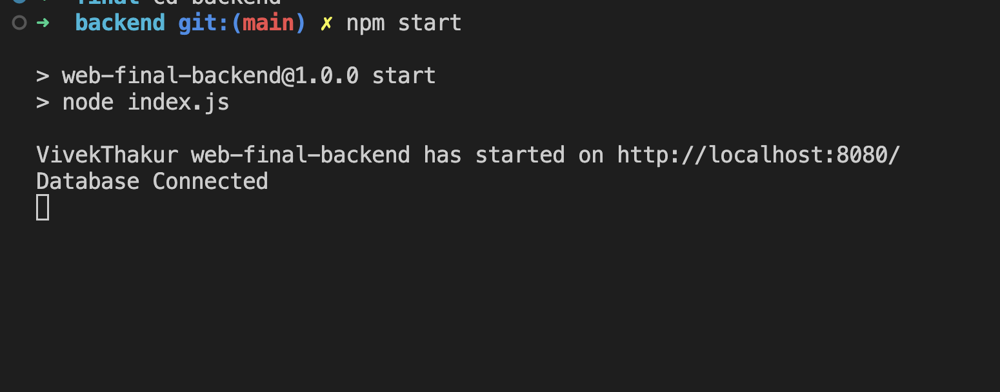
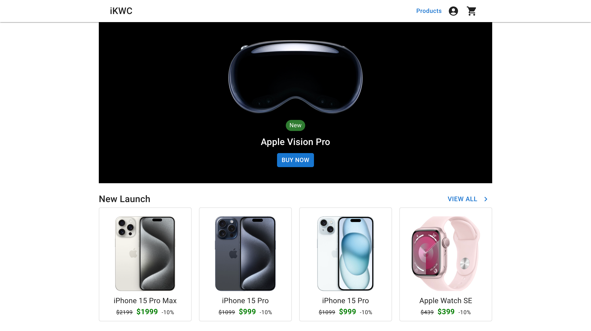

# Web-Final-Project

This project has 2 parts frontend and backend

## Backend

```
cd backend
```

```
npm install
```

```
npm start
```



## Frontend

```
cd frontend
```

```
npm install
```

```
npm start
```

This will start the frontend app on http://localhost:3000/


